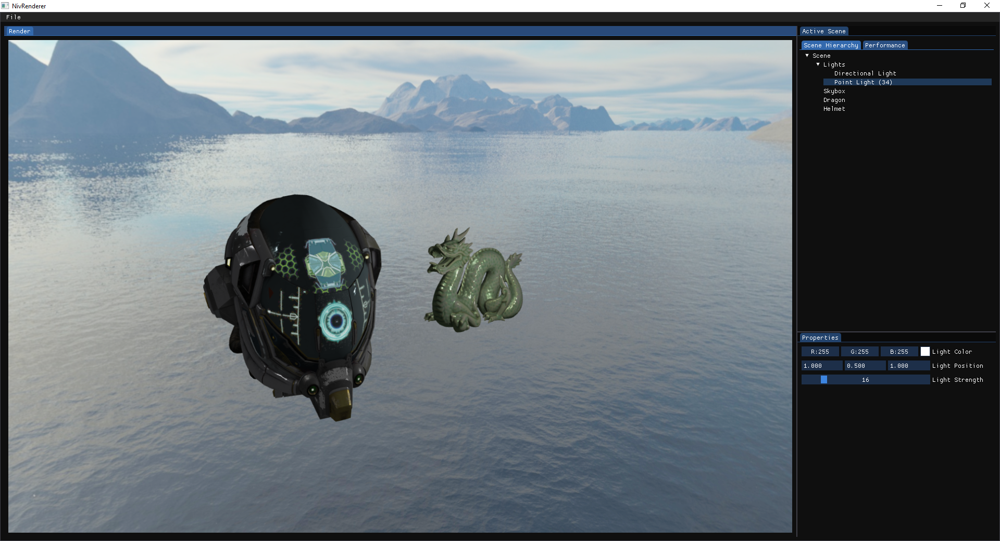

# NivRenderer

On-Going Personal Renderer Pet project.
This Renderer will be used to explore different kinds of Rendering Algorithms and to improve my Software Architecture skills.
I try to abstract stuff where needed and use Data-oriented-design patterns to make the Renderer easily extendable but still keep a good performance.

## Example Screenshot
